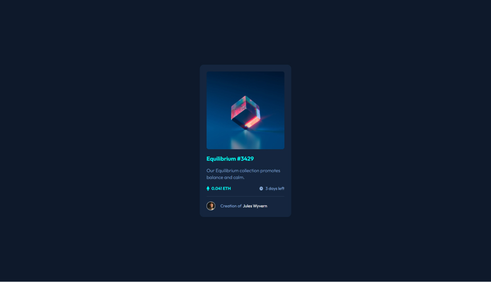

# Frontend Mentor - NFT preview card component solution

This is a solution to the [NFT preview card component challenge on Frontend Mentor](https://www.frontendmentor.io/challenges/nft-preview-card-component-SbdUL_w0U). Frontend Mentor challenges help you improve your coding skills by building realistic projects. 

## Table of contents

- [Frontend Mentor - NFT preview card component solution](#frontend-mentor---nft-preview-card-component-solution)
  - [Table of contents](#table-of-contents)
  - [Overview](#overview)
    - [The challenge](#the-challenge)
    - [Screenshot](#screenshot)
    - [Links](#links)
  - [My process](#my-process)
    - [Built with](#built-with)
    - [What I learned](#what-i-learned)
    - [Continued development](#continued-development)
  - [Author](#author)
  - [Acknowledgments](#acknowledgments)

**Note: Delete this note and update the table of contents based on what sections you keep.**

## Overview

### The challenge

Users should be able to:

- View the optimal layout depending on their device's screen size
- See hover states for interactive elements

### Screenshot



### Links

- Solution URL: [https://github.com/KrzysztofGrudzien/frontend-mentor-nft-card-component](https://github.com/KrzysztofGrudzien/frontend-mentor-nft-card-component)
- Live Site URL: [https://krzysztofgrudzien.github.io/frontend-mentor-nft-card-component/](https://krzysztofgrudzien.github.io/frontend-mentor-nft-card-component/)

## My process

### Built with

- Semantic HTML5 markup
- CSS custom properties
- Flexbox
- Mobile-first workflow
- BEM Methodology

### What I learned

In this project, I tried to repeat my knowledge about pure HTML and CSS. As an additional tip, I used CSS properties and BEM Methodology.

Few lines of code from the project:

```html
<article class="card">
    <div class="card__img-wrapper">
        
        <div class="card__img-overlay"></div>
        
    </div>
    <h1 class="card__title">Equilibrium #3429</h1>
    <p class="card__description">Our Equilibrium collection promotes balance and calm.</p>
    <div class="label">
        <div class="label__eth">
            
            <span class="label__text label__text--light">0.041 eth</span>
        </div>
        <div class="label__days">
            
            <span class="label__text">3 days left</span>
        </div>
    </div>
    <footer class="footer">
        
        <p class="footer__description">Creation of<span class="text-white">Jules Wyvern</span></p>
    </footer>
</article>
```
```css
.card__img-wrapper {
    position: relative;
}

.card__icon {
    left: 50%;
    position: absolute;
    opacity: 0;
    top: 50%;
    transform: translate(-50%, -50%);
    transition: opacity 0.3s ease;
    z-index: 1;
}

.card__img-wrapper:hover > .card__icon {
    opacity: 1;
}

.card__img-overlay {
    background-color: var(--color-secondary);
    border-radius: var(--radius-8);
    cursor: pointer;
    height: 298px;
    left: 0;
    position: absolute;
    opacity: 0;
    top: 0;
    transition: opacity 0.3s ease;
    width: 100%;
}

@media screen and (max-width: 375px) {
    .card {
        padding: 2.4rem;
    }
}
```

### Continued development

## Author

- Website - [In progress]
- Frontend Mentor - [@KrzysztofGrudzien](https://www.frontendmentor.io/profile/KrzysztofGrudzien)
- E-mail - krzysztof.grudzien.fed@gmail.com

## Acknowledgments
